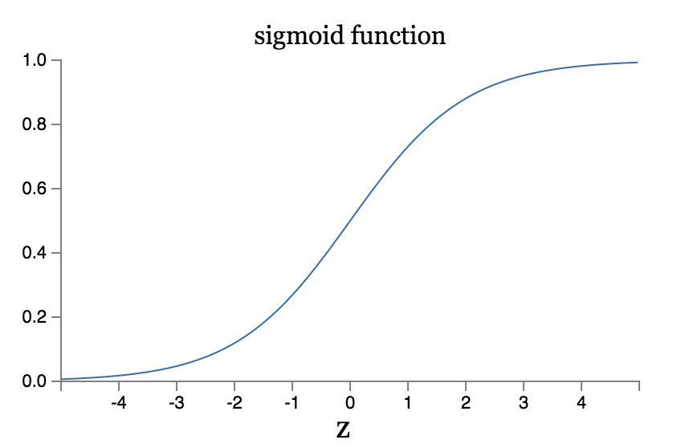

# Chapter 3
* The cross-entropy cost function
* Overfitting and regularization
* Weight initialization
* Handwriting recognition revisited: the code
* How to choose a neural network's hyper-parameters?
* Other techniques

---
## [The cross-entropy cost function](http://neuralnetworksanddeeplearning.com/chap3.html#the_cross-entropy_cost_function)
Ideally, we hope and expect that our neural networks will learn fast from their errors.

Human often learn fastest when we are badly wrong about something. But the artificial neuron has a lot of difficulty learning when it's badly wrong - far more difficulty than when it is just a little wrong. To understand the origin of this problem, consider that neuron learns by changing the weight and bias at a rate determined by the partial derivatives of the cost function, $\partial C / \partial w$ and $\partial C / \partial b$. So saying "learning is slow" is really the same as saying that those partial derivatives are small.

(https://upload.wikimedia.org/wikipedia/commons/5/53/Sigmoid-function-2.svg)
$$
\begin{equation} \label{eq:1}
\frac{\partial C}{\partial w}=(a-y)\sigma'(z)x=a\sigma'(z) \\
\frac{\partial C}{\partial b}=(a-y)\sigma'(z)=a\sigma'(z)
\end{equation}
$$
From the graph of the sigmoid function, when the neuron's output is close to 1, the curve gets very flat, and so $\sigma's(z) get very small.$ This is the origin of the learning slowdown.

### Introducing the cross-entropy cost function
How can we address the learning slowdown? It turns out that we can solve the problem by replacing the quadratic cost with a different cost function, known as the cross-entropy.
$$
\begin{equation} \label{eq:2}
z = \sum_{j}w_{j}x_{j} + b \\
a=\sigma(z) \\
C=-\frac{1}{n}\sum_{x}[y\ln a + (1-y)\ln (1-a)]
\end{equation}
$$
where:
* $z$ is the weighted sum of the inputs,
* $a$ is the output from the neuron,
* $C$ is the defined **cross-entropy cost function.**
* $n$ is the total number of items of training data, the sum is over all training inputs, $x$ and $y$ is the corresponding desired output. 

Two properties in particular make it reasonable to interpret the cross-entropy as a cost function:
1. it's non-negative
	* All the individual terms in the sum in $(2)$ are negative, since both logarithms are of numbers in the range $0$ to $1$,
	* There is a minus sign out the front of the sum.
2. If the neuron's actual output is close to the desired output for all training inputs $x$, then the cross-entropy will be close to zero.

Summing up, the cross-entropy is positive, and tends toward zero as the neuron gets better at computing the desired output $y$, for all training inputs $x$.

Cross-entropy avoids the problem of learning slowing down. To see this, let's compute the partial derivative of the cross-entropy cost with respect to the weights:
$$
\begin{equation} \label{eq: 3}
\begin{split}
\frac{\partial C}{\partial w_{j}} 
& = -\frac{1}{n}\sum_{x}(\frac{y}{\sigma(z)}-\frac{1-y}{1-\sigma(z)})\frac{\sigma}{\partial w_{j}} \\
& = -\frac{1}{n}\sum_{x}(\frac{y}{\sigma(z)}-\frac{1-y}{1-\sigma(z)})\sigma'(z)x_{j} \\
& = \frac{1}{n}\sum_{x}(\frac{\sigma'(z)x_{j}}{\sigma(z)(1-\sigma{z})}(\sigma(z)-y) \\
& = \frac{1}{n}\sum_{x}x_{j}(\sigma(z)-y)
\end{split} 
\end{equation}
$$
$$
\begin{equation} \label{eq: 4}
\frac{\partial C}{\partial b} = \frac{1}{n}\sum_{x}(\sigma(z)-y)
\end{equation}
$$
It tells us that the rate at which the weight learns is controlled by $\sigma(z)-y$, i.e., by the error in the output. The larger the error, the faster the neuron will learn. In particular, it avoids the learning slowdown caused by the $\sigma'(z)$.

The above cross-entropy for a single neuron. It's easy to generalize the cross-entropy to many-neuron multi-layer networks. In particular, suppose $y=y_{1}, y_{2},...$ are the desired values at the output neurons, i.e., the neurons in the final layer, while $a_{1}^{L}, a_{2}^{L},...$ are the actual output values. Then the cross-entropy is defined by:
$$
\begin{equation} \label{eq:4}
C=-\frac{1}{n}\sum_{x}\sum_{j}[y_{j}\ln a_{j}^{L}+(1-y_{j})\ln (1-a_{j}^{L})]
\end{equation}
$$

When should we use the cross-entropy instead of the quadratic cost? In fact, the cross-entropy is nearly always the better choice, provided the output neurons are sigmoid neurons.

Exerceses:
* 
* 

Problems:
* **Many-layer multi-neuron networks**
* **Using the quadratic cost when we have linear neurons in the output layer**

### Using the cross-entropy to classify MNIST digits
```bash
>>> import mnist_loader
>>> training_data, validation_data, test_data = \
... mnist_loader.load_data_wrapper()
>>> import network2
>>> net = network2.Network([784, 30, 10], cost=network2.CrossEntropyCost)
>>> net.large_weight_initializer()
>>> net.SGD(training_data, 30, 10, 0.5, evaluation_data=test_data,
... monitor_evaluation_accuracy=True)
```

### What does the cross-entropy mean? Where does it come from?


